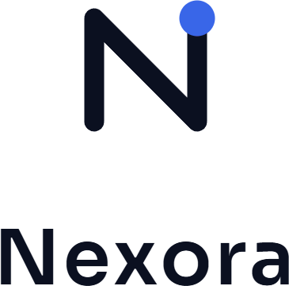
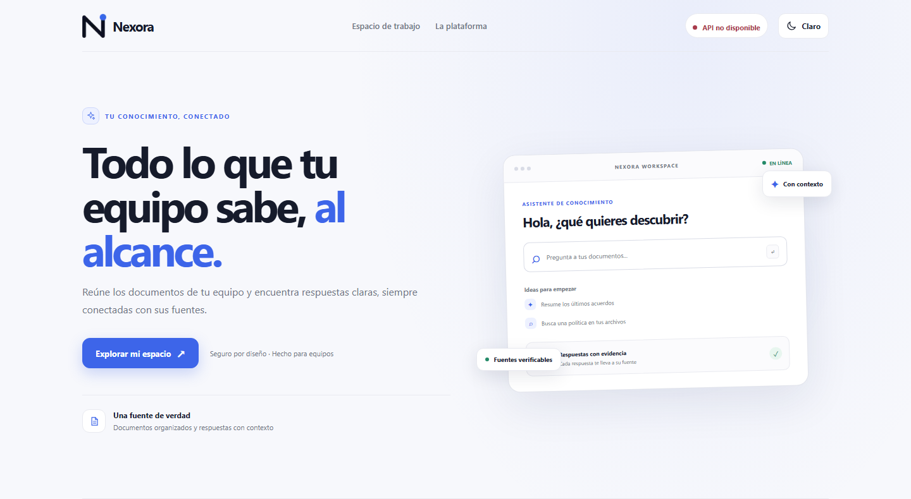
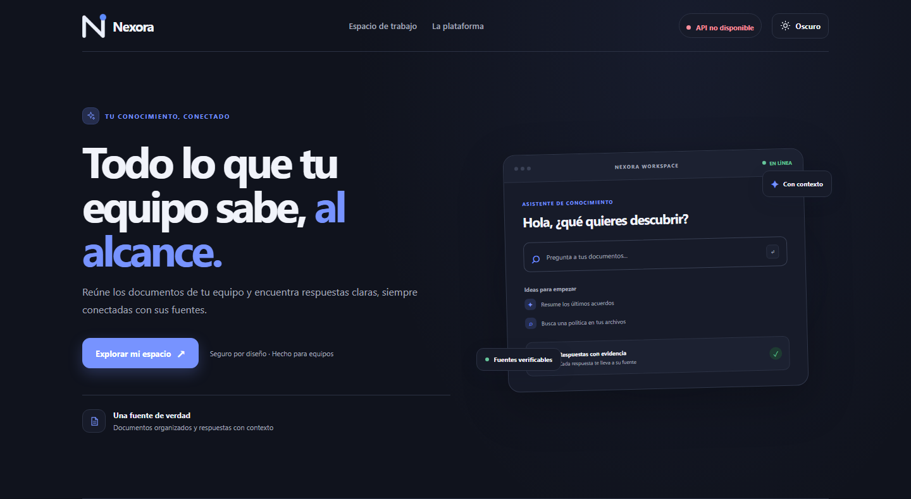

  
  <h1>El conocimiento de tu equipo, conectado.</h1>
  
Documentos organizados. Respuestas con fuentes. Un proyecto para aprender cómo se construye una aplicación real.

  
  

## Conoce Nexora

Nexora reúne la documentación de un equipo en un espacio privado. Permite encontrar contenido, hacer preguntas en lenguaje natural y consultar respuestas vinculadas a los documentos que les dan contexto.

La aplicación incluye inicio de sesión y organizaciones, invitaciones de un solo uso, permisos por rol, carga y búsqueda de documentos, extracción de texto y recuperación aumentada con generación (RAG) con citas. La identidad visual incorpora temas claro y oscuro y recuerda la preferencia elegida.

## Aprende construyendo

Este repositorio es un **proyecto educativo de aprendizaje guiado**. Presenta los conceptos y las decisiones detrás de cada funcionalidad para que una persona que empieza pueda avanzar paso a paso: desde autenticación y permisos hasta almacenamiento de documentos y RAG. El objetivo es entender cómo se conectan las piezas y por qué se construyen así, no solo copiar código.

- [Guía de aprendizaje](docs/guia-aprendizaje.md): cómo recorrer el proyecto desde cero.
- [Roadmap](docs/roadmap.md): fases y evolución del producto.
- [Pruebas](docs/testing.md): alcance de las comprobaciones del proyecto.
- [Decisiones de diseño](docs/adr/): motivos y alternativas de arquitectura.

## Cómo está construida

| Área | Tecnologías |
| --- | --- |
| Interfaz | Next.js, React, TypeScript y CSS |
| API | Python y FastAPI |
| Datos | PostgreSQL, SQLAlchemy y Alembic |
| Conocimiento | Extracción de documentos, búsqueda y RAG con citas |

## Límites del prototipo

Nexora sirve para aprender y experimentar; **no es un servicio listo para producción**. La autenticación no verifica el correo ni ofrece recuperación de cuenta. No uses documentos personales, confidenciales o de producción. Al habilitar OpenAI, el texto indexado, las preguntas y los fragmentos relevantes se envían al proveedor y pueden generar costes.

---

  Hecho para aprender, diseñado para explorar.

